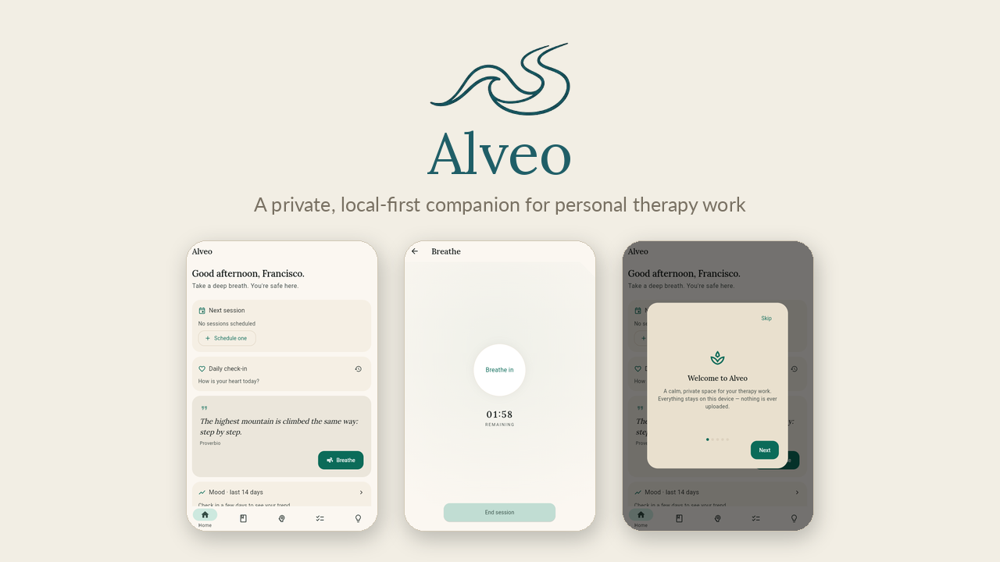

# Alveo 🌊

**A calm, private, local‑first companion for personal therapy work.**

<p align="center">
  <a href="https://h4tyr3l.github.io/alveoapp/">
    
  </a>
</p>

<p align="center"><a href="https://h4tyr3l.github.io/alveoapp/"><strong>Try it →</strong></a></p>

Alveo is a single‑user app for keeping track of how you're doing between and around
therapy sessions: mood check‑ins, a Markdown journal, session preparation and notes,
homework from your therapist, CBT thought records, a breathing exercise, and simple
trends over time. Everything lives on your own device.

> **Disclaimer.** Alveo is a personal tracking tool. It is **not** a medical device,
> it does not provide diagnosis or treatment, and it is **not** a substitute for
> professional care. In an emergency, contact your local emergency services or your
> care provider.

> **If you are in crisis or in danger**, call **911**, or the **Centro de Asistencia
> al Suicida**: **135** (free from Buenos Aires City and Greater Buenos Aires) or
> **(011) 5275-1135** (from anywhere in Argentina). The same numbers are one tap
> away inside the app, in Settings → About and at the top of the safety plan.

---

> [!WARNING]
> **Your data lives ONLY on your device.**
>
> - It is not stored on the developer's servers, and not on a ZimaOS server
>   either: a server only delivers the app, it never holds anything of yours.
> - If you uninstall the app, lose or reset the device, or clear your browser's
>   data, **your data is gone for good**.
> - The only backup is the one you make.
>
> **Back up often (once a week is a good rhythm):**
>
> 1. Open the app → **Settings** → **Your data** → **Export backup**.
> 2. Keep the `.json` file somewhere safe **off this device**: a cloud drive, an
>    email to yourself, another device. It is unencrypted — keep it private.
>
> **To get your data back** (new device, reinstall):
>
> 1. Install the app and open it.
> 2. **Settings** → **Your data** → **Import backup** → pick your latest `.json`.
> 3. An import only adds: nothing you already have is overwritten.

**Downloads:** https://github.com/iezappa/alveoapp/releases/latest ·
**Web version (iPhone, iPad, any browser):** https://h4tyr3l.github.io/alveoapp/

---

## Highlights

- **Local‑first, no backend.** No account, no sync server, no telemetry, no ads, no
  AI. Your data never leaves the device. The only request the app makes on its own
  is a version check (at most every six hours), and it carries nothing of yours.
- **Private by design.** Optional PIN lock with backoff on repeated failures. Backups
  are an explicit, user‑initiated file export.
- **Bilingual.** Full Spanish / English UI with a runtime toggle.
- **Warm, minimal design.** Material 3 with a warm cream palette and a serif display
  face; built to feel unhurried.
- **Runs on Linux, Windows, macOS, Android and the web.** The web build installs as
  a PWA (add to home screen on iOS/Android) and opens without a connection.

## Features

| Area | What it does |
| --- | --- |
| **Daily check‑in** | 1–5 mood scale with weather‑style icons, Plutchik emotion wheel, context tags, and a short note. |
| **Journal** | Markdown entries organised into notebooks (day lines, study, creativity, …) plus a monthly review. |
| **Sessions** | Prepare an agenda, take notes during, capture takeaways after; link a session to related tasks, journal entries and check‑ins. |
| **Tasks** | Track the homework assigned by your therapist, with a closing note when you finish. |
| **Tools** | CBT thought records: situation → automatic thought → evidence → reframe, with belief ratings and cognitive‑distortion tags. |
| **Breathe** | A guided breathing exercise (box 4·4·4·4 or calm 4·7·8). |
| **Insights** | A 14‑day mood sparkline on the dashboard and a fuller trend chart + calendar view. |
| **See everything** | One read‑only stream of every text you've written, newest first. |
| **Library** | A short motivational quote for each day of the year. |
| **Safety plan** | A private, structured plan (warning signs, coping steps, contacts). |
| **Medications** | Track medications and log intakes. |
| **Backups** | Full database export / import as a single JSON file, plus a spreadsheet‑readable CSV export for reading. |
| **Obsidian export** | Write journal entries out as Markdown into an Obsidian vault (desktop only). |
| **Onboarding** | First‑run name prompt and a short tutorial, re‑openable from Settings. |

## Tech stack

- **Flutter** (Dart SDK `^3.13.1`), Material 3
- **Riverpod** for state, **go_router** for navigation
- **Drift** over SQLite for persistence — a native file on desktop, WebAssembly +
  IndexedDB on the web (schema v9, with a migration test from every version ever shipped)
- **fl_chart** for trends, **pdf** for the doctor‑facing export, bundled **Lora** /
  **Lato** fonts

## Architecture

Feature‑first, with a framework‑free domain layer:

```
apps/client/lib/
  app/          # composition root: router, theme, locale, lock, onboarding
  domain/       # pure Dart: emotions, greeting, CBT, export renderers, …
  data/
    local/      # Drift database, tables, platform connections (native / web)
    repositories/  # one per aggregate, the only thing that touches Drift
    export/ transfer/ security/ search/ obsidian/
  features/     # one folder per screen area (UI + its providers)
  l10n/         # app_en.arb / app_es.arb (key parity is enforced by a test)
```

- Domain code has no Flutter or Drift imports and is unit‑tested in isolation.
- Screens read repository‑backed providers; list screens use a master–detail shell
  that becomes two‑pane on wide windows.
- Platform‑specific code (database connection, file saving, Obsidian) is selected
  with conditional imports.

## Running it

Prerequisites: Flutter (matching `apps/client/pubspec.yaml`; developed on 3.47.x).

```bash
cd apps/client
flutter pub get
flutter run -d linux      # or: -d macos / -d windows
flutter run -d chrome     # web
```

Regenerate the database code after changing tables:

```bash
dart run build_runner build --delete-conflicting-outputs
```

Tests and checks:

```bash
flutter test
flutter analyze
```

## Web / PWA deployment

`.github/workflows/deploy-web.yml` builds the web app and publishes it to GitHub
Pages on every push to the default branch:

- `flutter build web --release --base-href "/<repo>/"`
- SPA fallback (`404.html`) and `.nojekyll` are added
- deployed with `actions/deploy-pages`

- `tool/generate_sw.sh` stamps the app's own service worker (`web/sw.js`) with the
  version and a hash of every file, which is what makes the PWA open offline —
  Flutter's own worker only unregisters itself.

To install on a phone, open the published URL in Safari (iOS) or Chrome (Android)
and choose **Add to Home Screen**. When a new version is published the app shows
**"A new version is available"**; nothing changes under a page in use until you tap
**Update**.

> **iOS note.** Safari may clear a PWA's local storage after roughly a week of
> disuse. Open the app regularly and export a backup from Settings from time to time.

## Data & privacy notes

- The SQLite database is **not encrypted at rest**. The PIN gates the UI, it does not
  encrypt data. Rely on full‑disk encryption (BitLocker / FileVault / LUKS) and treat
  exported backups as sensitive files.
- Nothing is uploaded. A publicly hosted web build still only ever sees an empty
  local database in each visitor's browser.
- To erase everything: **Settings → Your data → Delete all my data**.

- [Privacy policy](PRIVACY.md) · [Terms of use](TERMS.md)

Developer: Zeke Zappa Developments (iezappa) — contact through
[the repository's issues](https://github.com/iezappa/alveoapp/issues).

## Installing it, per device

| Device | How |
|---|---|
| **iPhone / iPad** | Open https://h4tyr3l.github.io/alveoapp/ in **Safari** → Share → **Add to Home Screen**, and always open it from that icon. A tab and the installed icon keep separate data, and Safari can clear a site you stop visiting. |
| **Android** | Download `alveoapp-vX.Y.Z-android.apk` from the [latest release](https://github.com/iezappa/alveoapp/releases/latest) and install it (allow installs from this source once). Updates install on top — **never uninstall first, that deletes your data**. [Obtainium](https://github.com/ImranR98/Obtainium) can do it automatically from this repository. Or install the web version from Chrome; the two keep separate data. |
| **Windows** | Download `alveoapp-vX.Y.Z-windows-x64.zip`, extract it to a folder you keep, run the `.exe`. It is unsigned, so SmartScreen warns once: More info → Run anyway. |
| **Linux** | `sudo apt install libgtk-3-0`, then download `alveoapp-vX.Y.Z-linux-x64.tar.gz` and extract it somewhere you keep. |
| **macOS** | Download `alveoapp-vX.Y.Z-macos.zip`, move the app to Applications, then right-click → **Open** the first time (it is unsigned). |
| **Your own server** | ZimaOS/CasaOS with `deploy/docker-compose.yml` — see [`deploy/ZIMAOS.md`](deploy/ZIMAOS.md). Use one stable HTTPS URL (Tailscale); browser storage is per origin. |

Your data stays where the app is installed, so the desktop build, the APK and the
web version each keep their own. Moving between them is an export and an import.

## Updates

The app checks for a new version when it opens with a connection (at most once
every six hours) and shows a banner. If the banner asks for a backup, the release
changes how data is stored: export first, then update. After updating, the app
shows what changed.

## Status

Personal project, single maintainer. Not published to any app store: the signed APK
and the web PWA are the supported ways to install it.

## Releasing

Tagging `vX.Y.Z` builds the Linux, Windows and macOS archives, publishes the web
build and the `ghcr.io/iezappa/alveoapp` image, and creates the release. The APK is
built and signed on the maintainer's machine and attached afterwards — the keystore
never reaches CI. See [`docs/RELEASING.md`](docs/RELEASING.md) and
[`docs/SIGNING.md`](docs/SIGNING.md).
